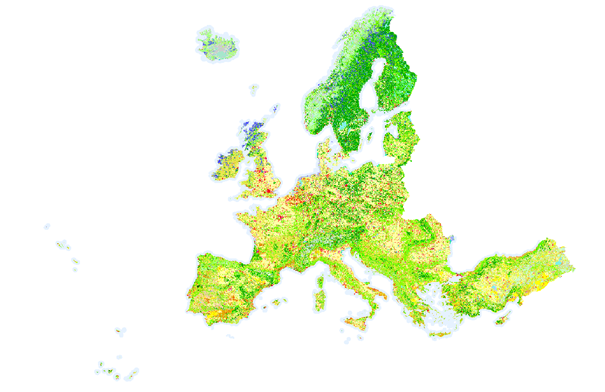

# Data

## Data source
The Copernicus Land Monitoring Service, which is the European Union's Earth observation program. Information from this program is made available through six thematic services: land, sea, atmosphere, climate change, emergency management and security. All information is free and open to all users.

Selected map - CLC 2018 raster version:

https://land.copernicus.eu/pan-european/corine-land-cover/clc2018?tab=download


## How to prepare data?
1. To download the map, you need an EIONET account. On the page there is a login button "Log in to download the data" for users who already have an account and a link "Follow this link to register" for new users.
2. After correctly creating an account and/or logging into the platform, select the data "Corine Land Cover - 100 meter" (row with data type "Raster") and press the "Download" button.
3. Unzip the downloaded archive
4. Unzip the archive inside the unzipped archive
5. Copy file with the path shown below to stork-relationships/land-data directory
```
u2018_clc2018_v2020_20u1_raster100m/DATA/U2018_CLC2018_V2020_20u1.tif
```
6. Change name of the file to:
```
landuse.tif
```


Raster map opened in QGIS with loaded legend:<br>

